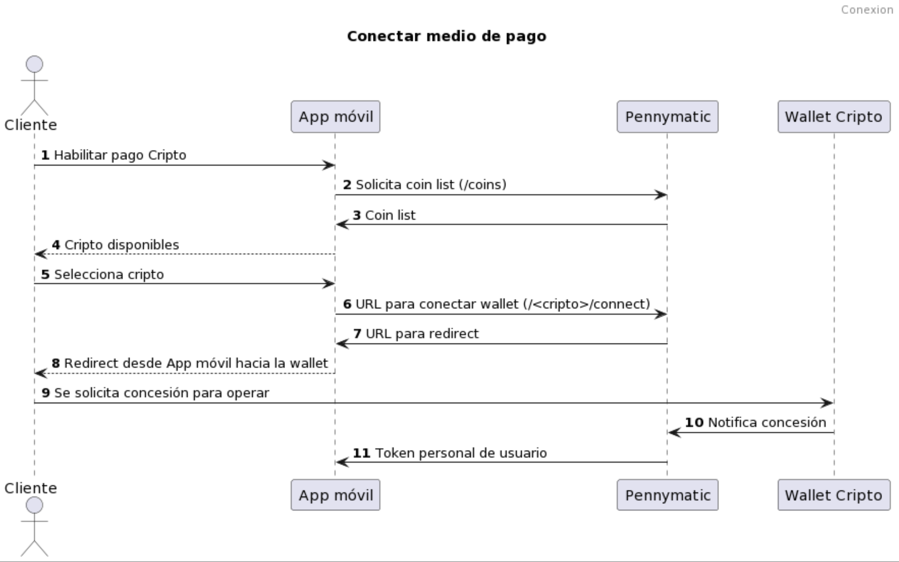
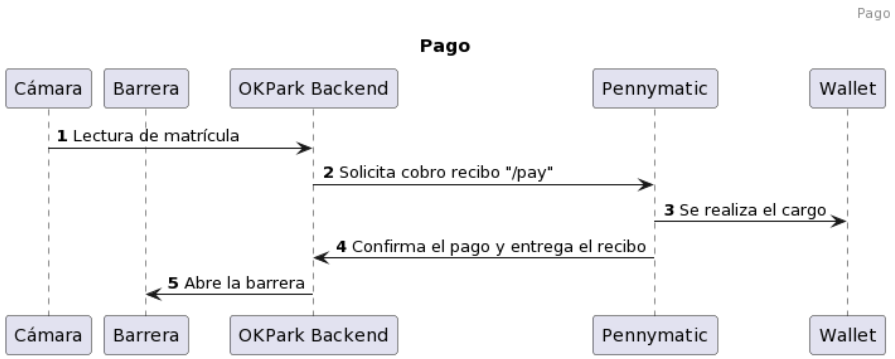

# Pennymatic

#### Versión 0.5


Los parámetros proporcionados por Pennymatic a cada cliente serán los siguientes:

  + **[[ENDPOINT]]**: url proporcionada por Tecnologías Blockchain para el MVP
  + **[[TOKEN]]**: proporcionado en cada caso desde Tecnologías Blockchain
  + **[[SECRET]]**: Requerido para operaciones POST. Proporcionado en cada caso desde Tecnologías Blockchain.


## Flujos operativos


Llamamos "operador" o "app" indistintamente al grupo de software en backend/frontend proporcionado a un consumidor. Es quien se integra con Pennymatic. Llamamos "cliente" al consumidor, propietario de la billetera (requerida si quiere pagar con criptomonedas) y al que se le realizarán cargos. 

Todas las operaciones devuelven un resultado y motivo del error cuando lo haya. Los flujos operativos soportados:

  + Obtener la lista de monedas soportadas por el gateway para ofrecer al cliente en la app ( "/coins").
  + Proceso de conexión de la billetera (ver "/[[coin]]/connect").
  + Realizar un cargo en la billetera del cliente (ver "/[[coin]]/pay")
  + Preguntar si la billetera del cliente sigue conectada (ver "/[[coin]]/connected")
  + Re-preguntar por el estado de confirmación de una operación de cobro conocida (ver "/[[coin]]/isconfirmed")
  + El logout (soft) de esta modalidad para un cliente consiste en olvidar el "usertoken" de ese cliente por parte del operador.


Queda fuera del alcance de Pennymatic:   
  + Pennymatic nunca guarda los "usertoken". Si se perdiera o ya es inservible, siempre se puede invitar al usuario a que inicie el proceso de conexión con su billetera ("connect").
  + "token", "secret" y "usertoken" debe ser custodiado por el operador como un secreto. Teóricamente un tercero podría hacer cargos en la billetera del cliente si llega a obtenerlo. Podemos disponer de una auditoría para conocer el origen de las invocaciones y restringirlas por origen.
  + El cliente puede desconectar la aplicación desde su billetera si dispone de esa funcionalidad. Es obligación del operador preguntar por el estado "connected" si quiere evitar los intentos fallidos de cobro.
  + El cliente ni el operador pueden deshacer las operaciones ya realizadas en la blockchain.
  + El operador debería guardar los datos de transacción blockchain que devuelve Pennymatic. Deberían ser incorporados en su base de datos para auditoría.
  


## API

###  GET /coins

Devuelve la lista de monedas disponibles. De momento solo devuelve "bsv" para el MVP. Requiere autenticación.


#### Parámetros

  + **ENDPOINT**, servicio API pennymatic
  + **TOKEN**, token proporcionado por Tecnologías Blockchain


#### Ejemplo

```
$ curl -X GET [[ENDPOINT]]/bsv/coins?token=[[TOKEN]] 
{
    "status": "success",
    "code": 0,
    "data": {
        "coins": [
            "bsv"
        ]
    }
}

```


###  GET /bsv/connect

Devuelve la lista de monedas disponibles. De momento solo devuelve "bsv" para el MVP. Requiere autenticación.




#### Parámetros

  + **ENDPOINT**, servicio API pennymatic
  + **TOKEN**, token proporcionado por Tecnologías Blockchain

#### Efecto

El resultado contiene una URL a la que hay que redirigir a los usuarios y el "sessionid" que permite relacionar el usuario que conectará su billetera cuando de forma asíncrona llegue el consentimiento a través de un webhook.
La redirección a la URL indicada es para llevar al cliente a su billetera y solicitar permiso para que se puedan realizar pagos de forma equivalente a como se hace con las tarjetas de crédito.


Ejemplo: solicitamos URL de conexión indicando que nos remita los datos de vuelta en el Webhook **http://localhost/callback**.

El Webhook es un endpoint que debe implementar el operador en su backend o app. La URL del webhook será invocada cuando el cliente otorgue el consentimiento de conectar la billetera. 
La URL del webhook se indicará "uriencoded", es decir, **http%3A%2F%2Flocalhost%2Fcallback**.

```
$ curl -X GET [[ENDPOINT]]/bsv/connect?token=[[TOKEN]]&webhook=[[URLENCODED]]
```

El resultado es:
```
{
    "status": "success",
    "code": 0,
    "data": {
        "sessionid": "c89d21c7-3140-4d44-adea-69e24541648d",
        "url": "https://app.handcash.io/#/authorizeApp?appId=6257ed344f6a4baa2eeefcec&sessionid=c89d21c7-3140-4d44-adea-69e24541648d"
    }
}
```

Hay que redirigir al usuario a la URL indicada en el campo "url" de "data". La redirección desde la app móvil será interpretada como un deeplink que invocará la wallet (normalmente otra app móvil en el dispositivo del cliente). En el ejemplo se invocará la wallet Handcash (o se indica que se instale).
Al usuario se le pedirá permiso para poder hacer cargos desde nuestra aplicación usando la pasarela de pago.


Una vez que el usuario conceda el permiso desde su billetera, Pennymatic invocará el webhook para enviar al operador un JSON con información del consentimiento del cliente. Siguiendo con el ejemplo, la URL invocada será 
**http://localhost/callback?usertoken=Usertoken&appId=AppId&sessionid=Sessionid**


El "userToken" debe ser guardada asociada al perfil del usuario. Para saber a qué usuario hay que asignarle el usertoken tenemos que hacer el match con el campo **sessionid** que se obtuvo al invocar a *connect* y de nuevo viene como parámetro en el webhook.
El appId no es importante conservarlo ya que será proporcionado cada vez y puede cambiar. 


###  GET /bsv/connected

Sirve para consultar a **pennymatic** si el [[USERTOKEN]] sigue siendo válido para automatizar pagos. Esta comprobación tiene sentido porque existe la posibilidad teórica de que el cliente haya retirado a la aplicación el permiso para operar pagos usando la propia wallet.
No hacer la comprobación puede resultar en que al intentar realizar el cobro se obtenga operación fallida.

Esta operación está pensada para poder mostrar el estado de este sistema de pago en la aplicación con la que opera el cliente.

#### Parámetros

  + **ENDPOINT**, servicio API pennymatic
  + **TOKEN**, token proporcionado por Tecnologías Blockchain
  + **USERTOKEN**, token de usuario obtenido tras "connect"


#### Ejemplo

Se responderá afirmativamente en aquellos casos en los que la transacción pertenezca al operador y se haya realizado a través de pennymatic. 

```
$ curl -X GET [[ENDPOINT]]/bsv/connected?token=[[TOKEN]]?authtoken=[[USERTOKEN]] 
{
    "status": "success",
    "code": 0,
    "data": true
}
```

Devolverá "false" si el [[USERTOKEN]] ya no es válido para operar los pagos en la wallet del cliente. En este caso hay que ofrecer al cliente que inicie el proceso de conexión de nuevo.
```
{
    "status": "success",
    "code": 0,
    "data": false
}
```


###  GET /bsv/isconfirmed

Se consulta si un pago está consolidado en la blockchain y por tanto es firme.


#### Parámetros

  + **ENDPOINT**, servicio API pennymatic
  + **TOKEN**, token proporcionado por Tecnologías Blockchain
  + **TX**, id de la transacción blockchain

#### Ejemplo

```
$ curl -X GET [[ENDPOINT]]/bsv/isconfirmed?token=[[TOKEN]]?txhash=[[TX]] 
{
    "status": "success",
    "code": 0,
    "data": true
}

```


Si la transacción es conocida por pennymatic y corresponde al operador pero no está consolidada en blockchain, el resultado es "false":

```
{
    "status": "success",
    "code": 0,
    "data": false
}
```

Cuando la transacción no pertenezca al operador de la pasarela se devolverá "undefined":

```
{
    "status": "success",
    "code": 0,
    "data": undefined
}
```


###  POST /bsv/pay

Se solicita que se realice un cargo en la billetera del cliente/consumidor. Para poder realizarlo se debe conocer el [[TOKEN]] que se emitió al conectar la billetera y las credenciales de operador Pennymatic.

La descripción será visible en la billetera del usuario, por lo que es una oportunidad para que sea significativa y permita al cliente reconocer el concepto.




#### Parámetros

**ENDPOINT**, servicio API pennymatic
**TOKEN**, token proporcionado por Tecnologías Blockchain
**SECRET**, secreto correspondiente a [[TOKEN]], proporcionado por Tecnologías Blockchain
**USERTOKEN**, dato devuelto en el flujo iniciado con "/connect".


#### Ejemplo

```
$ curl -X GET [[ENDPOINT]]/bsv/pay?token=[[TOKEN]] -H 'Content-type: application/json' \
    -d '{   "secret": "[[SECRET]]",
            "usertoken": "[[USERTOKEN]]",
            "currency": "EUR",
            "amount": 0.01,
            "description": "descripción servicio"
        }

```
